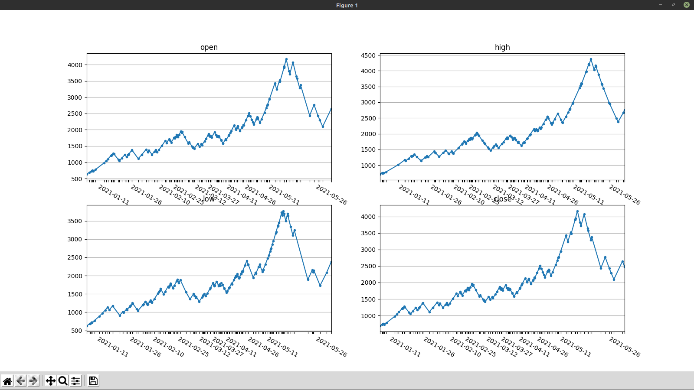

# Intristic time

One-off tool that makes figures like this



, see [this](https://www.dropbox.com/s/35hn9ycjhxdjb6p/Changing%20time%20scale.pdf?dl=0) paper for details

Not exactly the smartest thing to implement - any dashboarding tool on top of OHLC datasets would be much-much-much better.  Only that as of now I neither have a dashboarding tool that can run Python (like Periscope Data) nor publicly available OHLC datasets

## Install

```bash
pip install .
```

## Use

See `display-intristic --help`
